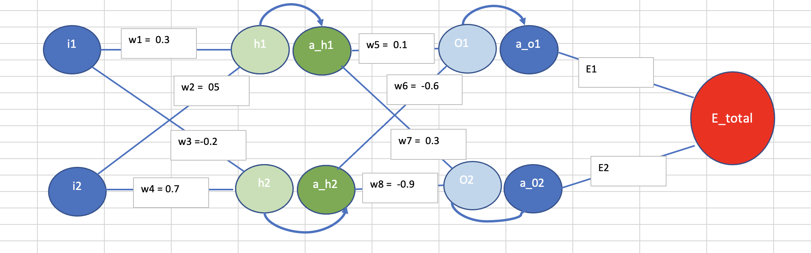

# Team

Nishad, Prasad, Owais, Senthil

# Part 1 

# Back propogation

The objective is train a neural network in excel and show back propogation working on weights

# Proof of work


## Network considered




# Calculations

* h1 = w1*i1 + w2*i2	
* h2 = w3*i1 + w4*i2	
* a_h1 = sigmoid(h1) = 1/(1+ exp(-h1))	
* a_h2 = sigmoid(h2) = 1/(1+ exp(-h2))	
* o1 = w5*a_h1 + w6*a_h2	
* o2 = w7*a_h1 + w8*a_h2	
* a_o1 = sigmoid(o1) = 1/(1+ exp(-o1))	
* a_o2 = sigmoid(o2) = 1/(1+ exp(-o2))	
* E_total = E1+ E2	
* E1 = 1/2*(t1-a_o1)^2	
* E1 = 1/2*(t2-a_o2)^2	
*
* ðE1/ða_h1 = a_01-t1*a_o1*(1-ao1)* a_h1*w5					
* ðE2/ða_h1 = a_02-t2*a_o2*(1-ao2)* a_h1*w7					
* ðE_total/ða_h1 = (a_01-t1)*a_o1*(1-ao1)**w5+ (a_02-t2)*a_o2*(1-ao2)* w7					
* ðE_total/ða_h2 = (a_01-t1)*a_o1*(1-ao1)* w6 + (a_02-t2)*a_o2*(1-ao2)* w8		
*
* ðE_total/ðw5 = ð(E1+E2)/ðw5	
* ðE_total/ðw5 = ð(E1)/ðw5	
* ðE_total/ðw5 = ð(E1)/ðw5= ðE1/ða_o1*ða_o1/ðo1*ðo1/ðw5	
* ðE1/ða_o1 = ð(1/2*(t1-a_o1)^2)/ða_o1 = -1(t1-a_o1) = a_01-t1	
* ða_o1/ðo1 = ð(1/(1+ exp(-o1)))/ðo1 = a_o1*(1-ao1)	
* ðo1/ðw5 = a_h1	
*
* ðE_total/ðw5 = (a_01-t1)*a_o1*(1-ao1)* a_h1			
* ðE_total/ðw6 = (a_01-t1)*a_o1*(1-ao1)* a_h2			
* ðE_total/ðw8 = (a_02-t2)*a_o2*(1-ao2)* a_h2			
* ðE_total/ðw7 = (a_02-t2)*a_o2*(1-ao2)*a_h1	
* 		
* ðE_total/ðw1 =a_01-t1*a_o1*(1-ao1)* a_h1*(1-ah1)*i1				
* ðE_total/ðw2 =a_01-t1*a_o1*(1-ao1)* a_h1*(1-ah1)*i2				
* ðE_total/ðw4 =a_02-t2*a_o2*(1-ao2)* a_h2*(1-ah2)*i2				
* ðE_total/ðw3 =a_02-t2*a_o2*(1-ao2)* a_h2*(1-ah2)*i1			
*
* ðE_total/ðw1 =ðE_total/ða_h1*ða_h1/ðh1*ðh1/w1 =  ((a_01-t1)*a_o1*(1-ao1)*w5+ (a_02-t2)*a_o2*(1-ao2)* w7)*a_h1*(1-a_h1)*i1										
* ðE_total/ðw2 =ðE_total/ða_h1*ða_h1/ðh1*ðh1/w2 =  ((a_01-t1)*a_o1*(1-ao1)*w5+ (a_02-t2)*a_o2*(1-ao2)* w7)*a_h1*(1-a_h1)*i2										
* ðE_total/ðw4=ðE_total/ða_h2*ða_h2/ðh2*ðh2/w4 =  ((a_01-t1)*a_o1*(1-ao1)*w6 + (a_02-t2)*a_o2*(1-ao2)* w8)*a_h2*(1-ah2)*i2										
* ðE_total/ðw3=ðE_total/ða_h2*ða_h2/ðh2*ðh2/w3 =  ((a_01-t1)*a_o1*(1-ao1)*w6 + (a_02-t2)*a_o2*(1-ao2)* w8)*a_h2*(1-ah2)*i1										

# Excel Calculations


# Error vs LR


# Error vs LR graph


## Observations
 
* As LR increases it converges faster - as it takes larger steps 


# Part 2 


# MNIST

The objective is achieve a test accuracy > 99.4% with less than 18K parameters within 19 epochs.


## Steps taken

*  Reduce parameters : reduced the channels max 32 used
*  Reduce overfitting : Added batch normalization and dropout
*  Data augmentation
  *  Random rotation 5 degress
  *  Colour Jitter


# Network Design

* Convolution block having 2 convolution layers followed by batch normalization
* One dropout for each convolution block
* MaxPool after convolution block
* Global average pooling before last linear layer

  ```
    ----------------------------------------------------------------
          Layer (type)               Output Shape         Param #
  ================================================================
              Conv2d-1            [-1, 8, 28, 28]              80
         BatchNorm2d-2            [-1, 8, 28, 28]              16
              Conv2d-3           [-1, 16, 28, 28]           1,168
         BatchNorm2d-4           [-1, 16, 28, 28]              32
             Dropout-5           [-1, 16, 28, 28]               0
           MaxPool2d-6           [-1, 16, 14, 14]               0
              Conv2d-7           [-1, 32, 14, 14]           4,640
         BatchNorm2d-8           [-1, 32, 14, 14]              64
              Conv2d-9           [-1, 24, 14, 14]           6,936
        BatchNorm2d-10           [-1, 24, 14, 14]              48
            Dropout-11           [-1, 24, 14, 14]               0
          MaxPool2d-12             [-1, 24, 7, 7]               0
             Conv2d-13             [-1, 16, 5, 5]           3,472
          AvgPool2d-14             [-1, 16, 1, 1]               0
             Linear-15                   [-1, 10]             170
  ================================================================
  Total params: 16,626
  Trainable params: 16,626
  Non-trainable params: 0
  ----------------------------------------------------------------
  ```
 
## Training and Loss

* Number of epochs : 19
* Loss - Negative log likehood
* batch_size = 128
* Adam optimizer used

  ```
      0%|          | 0/469 [00:00<?, ?it/s]EPOCH : 1
   /usr/local/lib/python3.7/dist-packages/ipykernel_launcher.py:34: UserWarning: Implicit dimension choice for log_softmax has been deprecated. Change the call to include dim=X as an argument.
   loss=0.1951860934495926 batch_id=468: 100%|██████████| 469/469 [00:29<00:00, 15.88it/s]
     0%|          | 0/469 [00:00<?, ?it/s]
   Test set: Average loss: 0.1778, Accuracy: 9515/10000 (95.15%)

   EPOCH : 2
   loss=0.12187216430902481 batch_id=468: 100%|██████████| 469/469 [00:28<00:00, 16.23it/s]
     0%|          | 0/469 [00:00<?, ?it/s]
   Test set: Average loss: 0.1427, Accuracy: 9550/10000 (95.50%)

   EPOCH : 3
   loss=0.041622504591941833 batch_id=468: 100%|██████████| 469/469 [00:30<00:00, 15.44it/s]
     0%|          | 0/469 [00:00<?, ?it/s]
   Test set: Average loss: 0.0894, Accuracy: 9713/10000 (97.13%)

   EPOCH : 4
   loss=0.037716399878263474 batch_id=468: 100%|██████████| 469/469 [00:30<00:00, 15.45it/s]
     0%|          | 0/469 [00:00<?, ?it/s]
   Test set: Average loss: 0.0674, Accuracy: 9797/10000 (97.97%)

   EPOCH : 5
   loss=0.07980864495038986 batch_id=468: 100%|██████████| 469/469 [00:29<00:00, 15.76it/s]
     0%|          | 0/469 [00:00<?, ?it/s]
   Test set: Average loss: 0.0462, Accuracy: 9863/10000 (98.63%)

   EPOCH : 6
   loss=0.025407209992408752 batch_id=468: 100%|██████████| 469/469 [00:28<00:00, 16.26it/s]
     0%|          | 0/469 [00:00<?, ?it/s]
   Test set: Average loss: 0.0442, Accuracy: 9874/10000 (98.74%)

   EPOCH : 7
   loss=0.004418657626956701 batch_id=468: 100%|██████████| 469/469 [00:29<00:00, 16.17it/s]
     0%|          | 0/469 [00:00<?, ?it/s]
   Test set: Average loss: 0.0462, Accuracy: 9849/10000 (98.49%)

   EPOCH : 8
   loss=0.078040212392807 batch_id=468: 100%|██████████| 469/469 [00:29<00:00, 16.14it/s]
     0%|          | 0/469 [00:00<?, ?it/s]
   Test set: Average loss: 0.0454, Accuracy: 9862/10000 (98.62%)

   EPOCH : 9
   loss=0.030806919559836388 batch_id=468: 100%|██████████| 469/469 [00:29<00:00, 16.12it/s]
     0%|          | 0/469 [00:00<?, ?it/s]
   Test set: Average loss: 0.0302, Accuracy: 9907/10000 (99.07%)

   EPOCH : 10
   loss=0.0046560498885810375 batch_id=468: 100%|██████████| 469/469 [00:29<00:00, 16.04it/s]
     0%|          | 0/469 [00:00<?, ?it/s]
   Test set: Average loss: 0.0306, Accuracy: 9912/10000 (99.12%)

   EPOCH : 11
   loss=0.0323166698217392 batch_id=468: 100%|██████████| 469/469 [00:29<00:00, 16.04it/s]
     0%|          | 0/469 [00:00<?, ?it/s]
   Test set: Average loss: 0.0336, Accuracy: 9897/10000 (98.97%)

   EPOCH : 12
   loss=0.012631400488317013 batch_id=468: 100%|██████████| 469/469 [00:29<00:00, 15.94it/s]
     0%|          | 0/469 [00:00<?, ?it/s]
   Test set: Average loss: 0.0457, Accuracy: 9867/10000 (98.67%)

   EPOCH : 13
   loss=0.05438346043229103 batch_id=468: 100%|██████████| 469/469 [00:29<00:00, 15.94it/s]
     0%|          | 0/469 [00:00<?, ?it/s]
   Test set: Average loss: 0.0430, Accuracy: 9865/10000 (98.65%)

   EPOCH : 14
   loss=0.012918871827423573 batch_id=468: 100%|██████████| 469/469 [00:29<00:00, 15.84it/s]
     0%|          | 0/469 [00:00<?, ?it/s]
   Test set: Average loss: 0.0317, Accuracy: 9904/10000 (99.04%)

   EPOCH : 15
   loss=0.007770549971610308 batch_id=468: 100%|██████████| 469/469 [00:29<00:00, 16.14it/s]
     0%|          | 0/469 [00:00<?, ?it/s]
   Test set: Average loss: 0.0297, Accuracy: 9914/10000 (99.14%)

   EPOCH : 16
   loss=0.011336133815348148 batch_id=468: 100%|██████████| 469/469 [00:29<00:00, 16.03it/s]
     0%|          | 0/469 [00:00<?, ?it/s]
   Test set: Average loss: 0.0283, Accuracy: 9912/10000 (99.12%)

   EPOCH : 17
   loss=0.03598247841000557 batch_id=468: 100%|██████████| 469/469 [00:29<00:00, 16.00it/s]
     0%|          | 0/469 [00:00<?, ?it/s]
   Test set: Average loss: 0.0310, Accuracy: 9900/10000 (99.00%)

   EPOCH : 18
   loss=0.01342777069658041 batch_id=468: 100%|██████████| 469/469 [00:29<00:00, 16.04it/s]
     0%|          | 0/469 [00:00<?, ?it/s]
   Test set: Average loss: 0.0340, Accuracy: 9895/10000 (98.95%)

   EPOCH : 19
   loss=0.031836893409490585 batch_id=468: 100%|██████████| 469/469 [00:29<00:00, 16.12it/s]

   Test set: Average loss: 0.0292, Accuracy: 9913/10000 (99.13%)


  ```

## Observations/ Learning

* Total params: 16,626
* Test accuracy achieved : 99.13
* No batch normalization or dropout was used to close to the prediction layer
